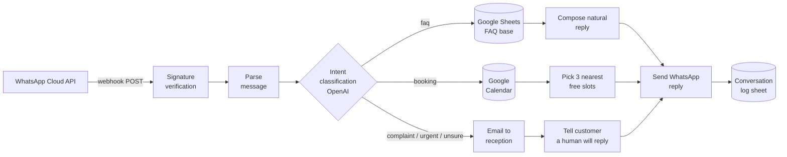

# WhatsApp AI Assistant for a Local Service Business

🇵🇱 [Wersja polska](README.pl.md)

**Status: working prototype.** Built as a portfolio project — it runs end to end on the free WhatsApp test number, but a client deployment would still need Meta business verification and a production number.

An n8n workflow that answers WhatsApp messages for a beauty salon: FAQ questions get an instant reply from a Google Sheets knowledge base, booking requests get the three nearest free slots from Google Calendar, and anything risky — complaints, urgent matters, low-confidence classifications — goes straight to a human with an email notification. Every conversation lands in a log sheet, so the owner can see exactly how many inquiries the bot handled on its own.

I built this because I kept seeing the same pattern at marketing agencies: a Facebook campaign works, inquiries pour into WhatsApp, and the receptionist — who has two hands and one phone — answers them hours later. By then a chunk of those leads has already booked with a competitor. The ad budget pays for inquiries that die in the inbox. This bot cuts the response time from hours to seconds without pretending it can handle everything.

## How it works



A message travels through the workflow like this:

1. Meta calls the n8n webhook. The `X-Hub-Signature-256` header is verified with HMAC-SHA256 against the app secret (constant-time comparison, computed over the raw request body) — a request with a bad signature throws before anything else runs.
2. The payload is parsed. Delivery statuses and non-text messages end the execution silently.
3. OpenAI classifies the intent into `faq`, `rezerwacja` (booking), `eskalacja` (escalation) or `inne` (other), with a confidence score.
4. The safe rule: confidence below 0.7, category "other", an unknown category, or malformed model output — all of these escalate to a human. A wrong answer to a salon customer costs more than a short wait.
5. FAQ branch: the question-answer base is read from Google Sheets and OpenAI phrases a reply using only that base. If the base has no answer, the message escalates instead of guessing.
6. Booking branch: free/busy data comes from Google Calendar; the workflow proposes the three nearest 60-minute slots within opening hours (Mon–Fri 9–19, Sat 9–14, Europe/Warsaw), with a 2-hour lead time.
7. Escalation branch: reception gets an email with the message and the customer's number; the customer gets an honest "a human will get back to you shortly".
8. The reply goes out through the WhatsApp Cloud API and the whole exchange is appended to the log sheet: timestamp, phone, message, intent, handled by bot or human, response.

## What's in the repo

```
workflows/whatsapp-assistant.json   n8n workflow export (23 nodes)
mock-data/faq-example.csv           sample FAQ base for the sheet
tests/run-tests.mjs                 tests running the actual node code
docs/setup.md                       step-by-step deployment guide (PL)
docs/demo-script.md                 live-demo script for agency talks (PL)
docs/index.html                     simulated conversation preview
.env.example                        every variable the workflow needs
```

## Tests

```
node tests/run-tests.mjs
```

22 tests, no dependencies to install. The test runner extracts the JavaScript straight out of the Code nodes in `workflows/whatsapp-assistant.json` and executes it in a sandbox — so what's tested is exactly what n8n runs, not a copy that could drift. Covered end to end: signature verification (including a tampered-body case), payload parsing, the escalate-when-unsure rule, FAQ answer handling, and slot picking against a busy calendar (including "everything's booked" giving an honest reply instead of an invented slot).

## Running it

The full guide with a checklist is in [docs/setup.md](docs/setup.md) — realistic setup time is 60–90 minutes, most of it clicking through Meta for Developers and Google OAuth consents. The short version:

1. Create a Meta app, enable WhatsApp, grab the free test number (90 days, up to 5 test recipients — enough for a demo, not for production).
2. Import `workflows/whatsapp-assistant.json` into n8n, set the environment variables from `.env.example`, connect the five credentials (OpenAI, Sheets, Calendar, Gmail, WhatsApp).
3. Point the Meta webhook at `https://<your-n8n>/webhook/whatsapp` and subscribe to the `messages` field.

## Known limits

- The Meta test number reaches at most 5 registered recipients. A real deployment needs Meta business verification (2–10 business days).
- The booking branch proposes slots but doesn't write to the calendar — confirming a visit stays with the receptionist by design in this MVP.
- One language per instance (Polish here); the prompts are three Code nodes away if you want to swap it.
