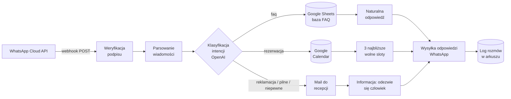

# Asystent AI na WhatsAppie dla lokalnego biznesu usługowego

🇬🇧 [English version](README.md)

Workflow n8n, który odpowiada na wiadomości WhatsApp w imieniu salonu kosmetycznego: pytania z FAQ dostają natychmiastową odpowiedź z bazy w Google Sheets, prośby o wizytę — trzy najbliższe wolne terminy z Google Calendar, a wszystko ryzykowne (reklamacje, sprawy pilne, niepewne klasyfikacje) trafia od razu do człowieka razem z powiadomieniem mailowym. Każda rozmowa ląduje w arkuszu-logu, więc właściciel widzi czarno na białym, ile zapytań bot obsłużył sam.

Zbudowałem to, bo w agencjach marketingowych wciąż powtarza się ten sam schemat: kampania na Facebooku działa, zapytania sypią się na WhatsAppa, a recepcjonistka — która ma dwie ręce i jeden telefon — odpisuje po kilku godzinach. W tym czasie część leadów zdążyła się umówić u konkurencji. Budżet reklamowy płaci za zapytania, które umierają w skrzynce. Ten bot skraca czas odpowiedzi z godzin do sekund i nie udaje, że umie obsłużyć wszystko.

## Jak to działa



Droga wiadomości przez workflow:

1. Meta wywołuje webhook w n8n. Nagłówek `X-Hub-Signature-256` jest weryfikowany HMAC-SHA256 względem sekretu aplikacji (porównanie w stałym czasie, liczone na surowym body żądania) — żądanie ze złym podpisem wywala się, zanim cokolwiek innego się wykona.
2. Payload jest parsowany. Statusy doręczeń i wiadomości nietekstowe kończą wykonanie po cichu.
3. OpenAI klasyfikuje intencję: `faq`, `rezerwacja`, `eskalacja` albo `inne`, z oceną pewności.
4. Zasada bezpieczna: pewność poniżej 0.7, kategoria „inne", nieznana kategoria albo zepsuta odpowiedź modelu — wszystko to eskaluje do człowieka. Zła odpowiedź dla klientki salonu kosztuje więcej niż chwila czekania.
5. Gałąź FAQ: baza pytań i odpowiedzi jest czytana z Google Sheets, a OpenAI formułuje odpowiedź wyłącznie na jej podstawie. Gdy bazy nie starcza — eskalacja zamiast zgadywania.
6. Gałąź rezerwacji: zajętość z Google Calendar, propozycja trzech najbliższych slotów po 60 minut w godzinach otwarcia (pn–pt 9–19, sob 9–14, Europe/Warsaw), z 2-godzinnym wyprzedzeniem.
7. Gałąź eskalacji: recepcja dostaje maila z treścią i numerem klienta, klient — uczciwe „ktoś odezwie się wkrótce".
8. Odpowiedź wychodzi przez WhatsApp Cloud API, a cała wymiana dopisuje się do logu: znacznik czasu, numer, wiadomość, intencja, kto obsłużył (bot/człowiek), odpowiedź.

## Co jest w repo

```
workflows/whatsapp-assistant.json   eksport workflow n8n (23 node'y)
mock-data/faq-example.csv           przykładowa baza FAQ do arkusza
tests/run-tests.mjs                 testy uruchamiające prawdziwy kod node'ów
docs/setup.md                       przewodnik wdrożenia krok po kroku
docs/demo-script.md                 scenariusz demo na rozmowę z agencją
docs/index.html                     podgląd symulowanej rozmowy
.env.example                        komplet zmiennych, których potrzebuje workflow
```

## Testy

```
node tests/run-tests.mjs
```

22 testy, zero zależności do instalowania. Runner wyciąga JavaScript prosto z Code node'ów w `workflows/whatsapp-assistant.json` i wykonuje go w sandboxie — testowane jest dokładnie to, co uruchomi n8n, a nie kopia, która mogłaby się rozjechać. Pokryte od końca do końca: weryfikacja podpisu (w tym przypadek podmienionego body), parsowanie payloadu, zasada „eskaluj, gdy niepewne", obsługa odpowiedzi FAQ i wybór terminów przy zajętym kalendarzu (łącznie z „wszystko zajęte", które daje uczciwą odpowiedź zamiast wymyślonego terminu).

## Uruchomienie

Pełny przewodnik z checklistą jest w [docs/setup.md](docs/setup.md) — realny czas wdrożenia to 60–90 minut, z czego większość to klikanie po Meta for Developers i zgodach OAuth Google. W skrócie:

1. Załóż aplikację Meta, włącz WhatsApp, weź darmowy numer testowy (90 dni, do 5 odbiorców testowych — na demo starcza, na produkcję nie).
2. Zaimportuj `workflows/whatsapp-assistant.json` do n8n, ustaw zmienne z `.env.example`, podłącz pięć credentiali (OpenAI, Sheets, Calendar, Gmail, WhatsApp).
3. Skieruj webhook Mety na `https://<twoj-n8n>/webhook/whatsapp` i zasubskrybuj pole `messages`.

## Znane ograniczenia

- Numer testowy Mety dosięga maksymalnie 5 zarejestrowanych odbiorców. Prawdziwe wdrożenie wymaga weryfikacji biznesowej Mety (2–10 dni roboczych).
- Gałąź rezerwacji proponuje terminy, ale nie zapisuje do kalendarza — potwierdzenie wizyty celowo zostaje przy recepcjonistce w tym MVP.
- Jeden język na instancję (tutaj polski); prompty do podmiany siedzą w trzech Code node'ach.
